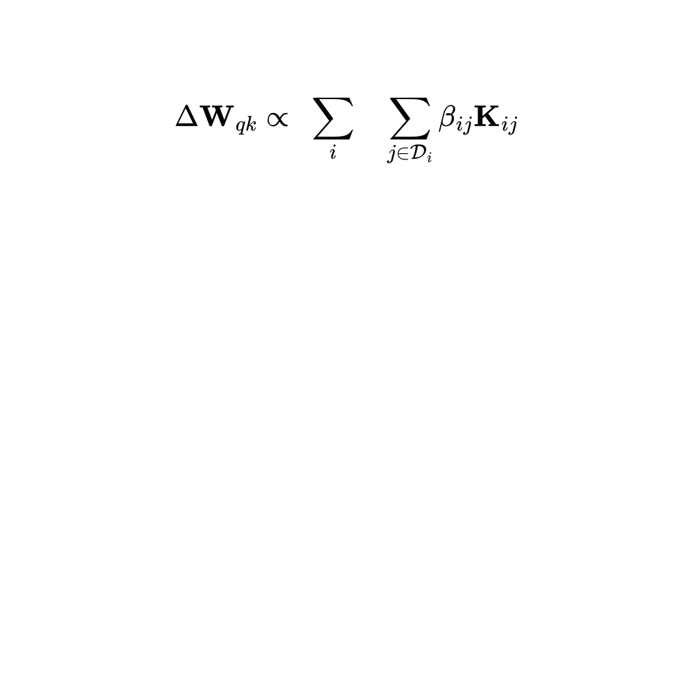

  
   <nav style="font-size: 35px; margin: 0;">
    <li><a href="https://matteosaponati.github.io/">matteosaponati</a></li></nav>
    <nav style="font-size: 25px; margin-top: 1px;">
      <ul class="link-list">
        <li><a href="https://matteosaponati.github.io/research">research</a></li>
        <li><a href="https://matteosaponati.github.io/year-archive/">blog</a></li>
        <li><a href="https://matteosaponati.github.io/music">music</a></li>
        <li><a href="/files/cv.pdf">cv</a></li>
      </ul>
    </nav>
  
  

      

 

  

    <h2>The underlying structures of self-attention: symmetry, directionality, and emergent dynamics in Transformer training</h2> 
  

   

  

  

        <ul>
            <li>
                <strong>01.05.25</strong>
                The paper got accepted to ICML 2025 :)
                 
                 
                "The underlying structures of self-attention: symmetry, directionality, and emergent dynamics in Transformer training"
                 
                ICML Proceedings -
                <!-- <a href="" target="_blank">ICML Proceedings</a> -  -->
                <a href="https://arxiv.org/abs/2502.10927" target="_blank">ArXiv</a> - 
                <a href="https://github.com/matteosaponati/attention-geometry" target="_blank">code</a>
            </li>
        </ul>
    

    

  

   

  

  <strong>SUMMARY</strong>
  

   
  Self-attention hides a simple geometry: bidirectional encoders induce symmetric matrices, while autoregressive decoders grow a few supersized columns that make the matrices directional. We find this pattern across ModernBERT, GPT, LLaMA 3, and many other models. We also show that symmetric initialization for small and large encoder models reduces training time by up to 70 % without hurting accuracy.

  

   
  

  <strong>1 - Self-attention and bilinear forms</strong>
  

   

  Let's start by observing that self-attention is basically a score function  \( A : \mathbb{R}^{N,d} \times \mathbb{R}^{N,d} \rightarrow \mathbb{R}^{N,N} \), which maps a sequence of \( N \) token embeddings (each of dimension \( d \)) into an \( N \times N \) matrix of attention scores. Beneath the softmax, attention is just a linear transformation of the token embeddings,

  $$
  A(\mathbf{X}) = \sigma\left(\frac{1}{\sqrt{d}} \, \hat{A}(\mathbf{X})\right)
  = \sigma\left(\frac{1}{\sqrt{d}} \, \mathbf{QK}^\top\right)
  = \sigma\left(\frac{1}{\sqrt{d}} \, \mathbf{X} \mathbf{W}_{qk} \mathbf{X}^\top \right) \,,
  $$

  where \( \hat{A}(\mathbf{X}) \) is the linear core of attention, and \( \mathbf{X} \) is a matrix of token embeddings, \( \mathbf{X} = [\mathbf{x}_1^\top, \ldots, \mathbf{x}_N^\top] \in \mathbb{R}^{N,d}\) where each row is a token living in a \( d \)-dimensional space.

  Now, instead of thinking about query and key projections separately, we merge them into a single matrix [1,2,3],
  $$
  \mathbf{W}_{qk} = \mathbf{W}_q \mathbf{W}_k^\top \in \mathbb{R}^{d,d} \,,
  $$
  and therefore, the entry \( \hat{\alpha}_{ij} = [\hat{A}]_{ij} \) is given by
  $$
  \hat{\alpha}_{ij} = \langle \mathbf{q}_i, \mathbf{k}_j \rangle = 
  \langle \mathbf{x}_i, \mathbf{W}_{qk} \mathbf{x}_j \rangle = 
  \langle \mathbf{x}_i, \mathbf{x}_j \rangle_{\mathbf{W}_{qk}} \,.
  $$
  This shows that self-attention is not just about comparing queries and keys, but rather about comparing them under a geometry that the model learns, and this geometry is encoded directly in \( \mathbf{W}_{qk} \). 

  In the paper, we show that this matrix \( \mathbf{W}_{qk} \) contains interesting structures that can be linked to the specific objective function used during training.
  
    
  

  <strong>2 - Deriving the implicit gradients of self-attention</strong>
  

   

  We begin by formulating a self-supervised sequence modeling problem. 
  Let \( U = \{t_1, \ldots, t_N\} \) be a sequence of \( N \) tokens. 
  For each position \( i \), let \( \mathcal{D}_i \subseteq \{1, 2, \ldots, N\} \) 
  denote the <em>conditioning set</em>, that is, the set of indices corresponding to the tokens used to predict the token \( t_i \). 
  This formulation allows us to isolate and analyze the contribution of each token \( t_j \in \mathcal{D}_i \) 
  to the prediction of \( t_i \). 
  We then model the joint probability distribution over the sequence using a Transformer with parameters \( \mathcal{W} \), 
  and train it by minimizing the negative log-likelihood of each token \( t_i \).

    
  

    
  

   

  During unsupervised pre-training, a Transformer model receives a sequence of tokens, converts each token into a vector embedding, and processes these embeddings through multiple stacked layers of self-attention and MLPs. This produces updated vector representations, which are then used to predict each token with predictions \( \hat{t}_1 \), ..., \( \hat{t}_N \), according to the negative log-likelihood objective we defined above.

    
  

    
  

   

  Focusing on a single self-attention layer, self-attention computes a new representation for a prediction token (e.g., token 3) by mixing the embeddings of all tokens in its conditioning set (the context). Each context token contributes to this representation proportionally to its attention score with the prediction token, and each of these contributions adds a corresponding term to the overall loss. As shown earlier, the attention score between two tokens is just their dot product under the new weird bilinear form.

    
  

    
  

   

  It turns out that the implicit weight update of the bilinear form follows a structured pattern: 
  when token \(j\) is used to predict token \(i\), the update adds a rank-1 matrix \(\mathbf{K}_{ij}\) to 
  \(\mathbf{W}_{qk}\). In this update, the embedding of the context token \(j\) 
  contributes to the columns, while the embedding of the prediction token \(i\) 
  contributes to the rows. When considering the entire sequence of tokens (not just our example token 3) the total weight update becomes a linear combination of all rank-1 contributions across every context–prediction pair in the sequence.

    
  

    
  

   

  Interestingly, the double sum can be rearranged in two equivalent ways: one is by iterating over each predicted token and summing over its conditioning set; the other is by iterating over each context token and summing over all the tokens it helps predict (over all the conditioning sets in which that token appears).
  <!-- $$
  \sum_{i} \sum_{j  \in \mathcal{C}_i} \beta_{ij} \mathbf{K}_{ij} = \sum_{i \in \mathcal{P}_j} \sum_{j} \beta_{ij} \mathbf{K}_{ij}
  $$ -->

  

    
  

   

  This is a key step for understanding how different training objectives give rise to different structural patterns in the attention weights.

    
  

  <strong>3 - How context and prediction impact the gradient differently</strong>
  

   

  When a token \( t^∗ \) serves as context (\( t_j \)  = \( t^∗ \)), the embeddings of all predicted tokens contribute to the column space of the bilinear form, while only the embedding of \( t^∗ \) is instead added to the row space. Intuitively, using \( t^∗ \) as context increases the dimensionality of the column space proportionally to the embeddings of the predicted tokens, while reducing the row space along the direction of the embedding of \( t^∗ \). Conversely, when \( t^∗ \) is being predicted (\( t_i \)  = \( t^∗ \)), all token embeddings from the context are added to the row space, while only the embedding of \( t^∗ \) is added to the column space. 

    
  

    
  

   

  Something interesting follows: the role a token plays during training affects its contribution to the weight update differently.

    
  

  <strong>4 - The relation between objective functions and structures in self-attention matrices</strong>
  

   

  Crucially, the number of times a token \( t^∗ \) appears as context or as a prediction depends on the training objective. Autoregressive training implicitly introduces directionality by predicting each token solely on its preceding tokens. In contrast, bidirectional training uses tokens as context and as predictions symmetrically. 

    
  

    
  

   
  
  This fundamental difference affects the weight updates, and consequently, the structures encoded in its rows and columns. If you are interested, you can find more mathematical details <a href="https://arxiv.org/abs/2502.10927" target="_blank">in the paper</a>.

    
  

  <strong>5 - Symmetric and directional structures are predominant in Transformer models</strong>
  

   

  Then, we went and validate our theoretical findings by quantifying empirically the degree of symmetry and directionality in different families of open-source Transformer models. We find that encoder-only models remarkably show a higher degree of symmetry than decoder-only, and that decoder-only models have higher degrees of directionality than encoder-only models :) 

    
  

    
  

   

  This difference is consistent across multiple families of models and input modalities, such as BERT (Devlin et al., 2019), GPT (Radford et al., 2018; 2019), LLAMA3 (Touvron et al., 2023), Phi (Hughes, 2023; Abdin et al., 2024), MISTRAL (Jiang et al., 2023), ModernBERT (Warner et al., 2024), and many others.
  
    
  

  <strong>6 - Enforcing symmetry at initialization improves the training of encoder-only models</strong>
  

   

  All of this is interesting, but does it actually help in practice? That was a recurring question in our discussions. The simplest way to test it was to initialize encoder models symmetrically and see if it made a difference. And it did. We found that these structural insights can be used as an inductive bias to speed up training. Symmetric initialization led to faster convergence, allowing models to reach their final loss significantly quicker than with standard random initialization—up to 75% faster for 4-layer models, 35% for 12-layer, and 44% for 24-layer models (see all the results <a href="https://arxiv.org/abs/2502.10927" target="_blank">in the paper</a>). Viva! 

    
  

<table class="responsive-table">
  <thead>
    <tr>
      <th>Model</th>
      <th>Loss</th>
      <th>Speed-up</th>
    </tr>
  </thead>
  <tbody>
    <!-- 4-layer -->
    <tr><td class="model-section" colspan="3">4-layer model</td></tr>
    <tr><td data-label="Model">Red Pajama</td><td data-label="Loss">1.106</td><td data-label="Speed-up"></td></tr>
    <tr><td data-label="Model" class="symmetric">Red Pajama (+ symm)</td><td data-label="Loss" class="symmetric">0.907</td><td data-label="Speed-up">69%</td></tr>
    <!-- 12-layer -->
    <tr><td class="model-section" colspan="3">12-layer model</td></tr>
    <tr><td data-label="Model">Red Pajama</td><td data-label="Loss">0.297</td><td data-label="Speed-up"></td></tr>
    <tr><td data-label="Model" class="symmetric">Red Pajama (+ symm)</td><td data-label="Loss" class="symmetric">0.274</td><td data-label="Speed-up">35%</td></tr>
    <!-- 24-layer -->
    <tr><td class="model-section" colspan="3">24-layer model</td></tr>
    <tr><td data-label="Model">Red Pajama</td><td data-label="Loss">0.209</td><td data-label="Speed-up"></td></tr>
    <tr><td data-label="Model" class="symmetric">Red Pajama (+ symm)</td><td data-label="Loss" class="symmetric">0.189</td><td data-label="Speed-up">34%</td></tr>
  </tbody>
  </table>

    
  

  <strong>7 - Conclusions</strong>
  

   

  In this work, we explore how training objectives shape the structure of self-attention in Transformers. Our analysis shows that <strong>bidirectional training leads to symmetric query-key matrices</strong>, while <strong>autoregressive training produces directional patterns</strong> with dominant columns. 
    
  To test this, we introduced symmetry and directionality scores and applied them across a wide range of encoder and decoder models—spanning text, audio, and image data. The results match our theory: encoders show high symmetry, while decoders show clear directionality :D These patterns reveal fundamental properties of self-attention and offer a step toward better mechanistic interpretability of Transformer models. 
    
  Finally, we used this insight to boost training: by initializing models with symmetric \( \mathbf{W}_{qk} \), we achieved significantly faster convergence during bidirectional pre-training.
    
  
  

  refs:
    
  [1] <a href="https://transformer-circuits.pub/2021/framework/index.html" target="_blank">A Mathematical Framework for Transformer Circuits</a>. 
  Elhage, N., Nanda, N., Olsson, C., Henighan, T., Joseph, N., Mann, B., Askell, A., Bai, Y., Chen, A., Con- erly, T., et al. (2021). Transformer Circuits Thread.
   
  [2] <a href="https://transformer-circuits.pub/2022/in-context-learning-and-induction-heads/index.html" target="_blank">In-context Learning and Induction Heads</a>
  Olsson, C., Elhage, N., Nanda, N., Joseph, N., DasSarma, N., Henighan, T., Mann, B., Askell, A., Bai, Y., Chen, A., et al. (2022). Transformer Circuits Thread.
   
  [3] <a href="https://aclanthology.org/2023.acl-long.893/" target="_blank">Analyzing Transformers in Embedding Space</a>. 
  Dar, G., Geva, M., Gupta, A., and Berant, J. In Proceedings of the 61st Annual Meeting of the Association for Computational Linguistics, volume 1 of ACL.
    

  

