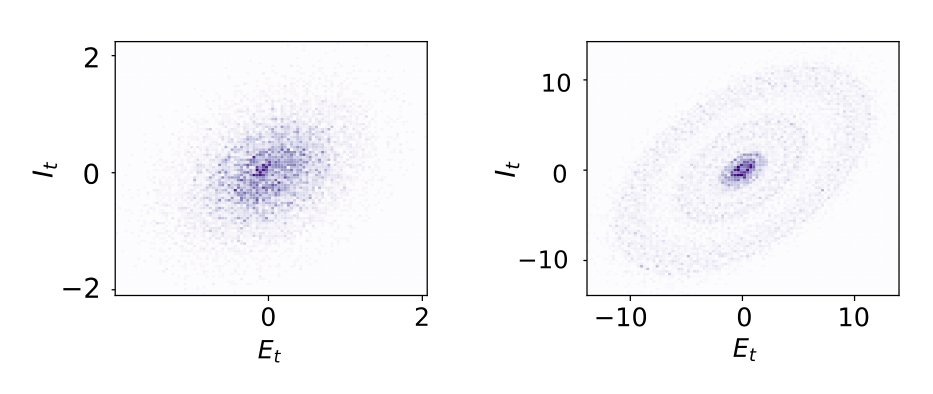

It turns out that the best model for describing statistical variabilities in neuronal oscillations is a simple, linear, damped harmonic oscillator.
  
<a href="https://www.nature.com/articles/s41467-022-29674-x" target="_blank">paper</a> | <a href="https://github.com/matteosaponati/spontaneous-gamma-circuit" target="_blank">code</a>

Oscillation patterns in the activity of populations of neurons are ubiquitous. You can find them in many brain areas across multiple scales. An infamous type of oscillatory activity happens in the gamma range (30-80 Hz) by interacting excitatory and inhibitory neurons in the sensory cortex. Despite many models describing such oscillations with nonlinear coupled dynamical systems, limit cycles, and the like, we find that such oscillations are quite noisy and unreliable. In the primary visual cortex (V1) of macaques, these oscillations have a strong cycle-to-cycle variability - their duration and amplitude are weaky correlated from one period to the other. It turns out that the best model for describing such variability is the simplest model possible: a linear damped harmonic oscillator.